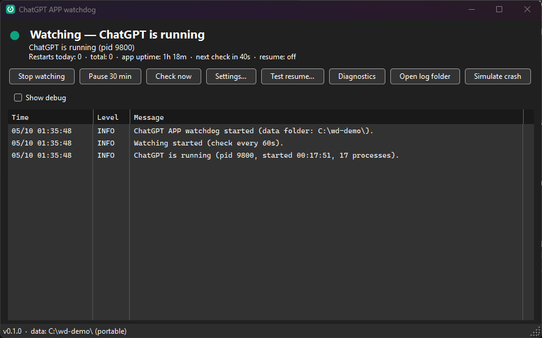
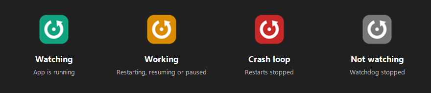
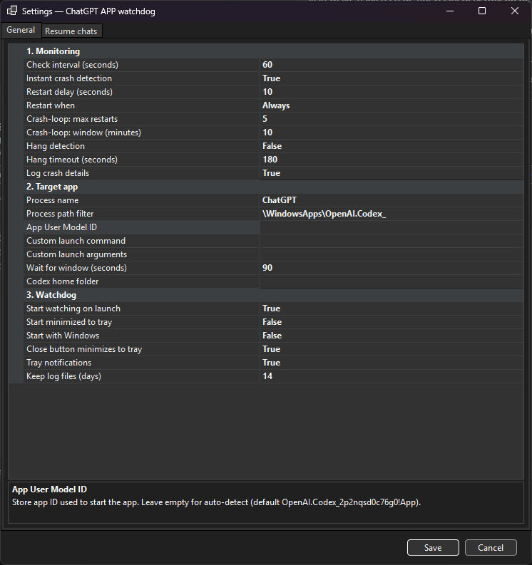
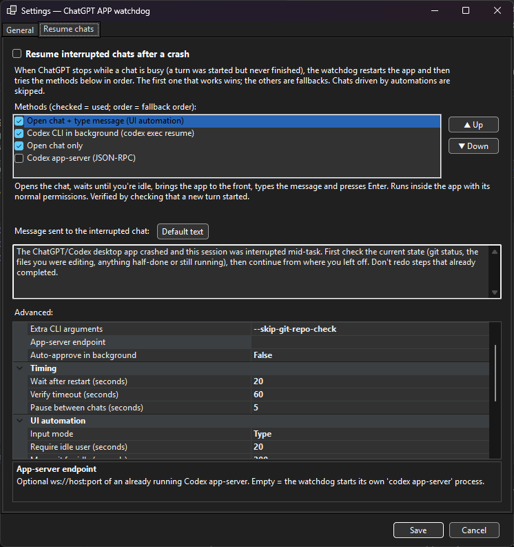

# ChatGPT APP watchdog

A small Windows tray app that keeps the **ChatGPT / Codex desktop app** running. When the app crashes or closes, the watchdog starts it again. It can also **resume the chats that were busy** when the app went down.

> Unofficial community tool. Not affiliated with, endorsed by or supported by OpenAI. "ChatGPT" and "Codex" are trademarks of OpenAI.

## Why

On Windows the ChatGPT desktop app (with Codex) sometimes closes by itself. Anything running in it then stops, including scheduled automations, until someone notices and starts the app again. The watchdog does that for you and logs what happened.

## Screenshots

**Main window.** Live status, restart counters and a log of what the watchdog sees and does.

<p align="center"></p>

**Tray icon states.** The tray icon always shows the current state at a glance.

<p align="center"></p>

**Settings.** Monitoring, restart rules, crash-loop protection and the target app...

<p align="center"></p>

...and the optional chat resume, with the method order and the message that is sent.

<p align="center"></p>

## Features

- **Monitoring** at a configurable interval (for example every 1, 5 or 10 minutes). It can also react **instantly** when the app's main process exits.
- **Automatic restart** of the Store app (`OpenAI.Codex_2p2nqsd0c76g0!App`, auto-detected) or of a custom command.
- **Restart delay**, so app self-updates and self-restarts are not doubled.
- **Crash-loop protection.** After N restarts in M minutes it stops restarting and notifies you.
- **Optional hang detection.** If the window is "Not responding" for too long, the app is killed and restarted.
- **Crash details** (exception code, faulting module) from the Windows event log, written to the log.
- **Resume interrupted chats (optional).** See below.
- A small window with status and a live log, plus a tray icon (green, orange, red, grey) and notifications.
- **Pause 30 min** (for when you close the app on purpose), **Check now**, **Diagnostics** and **Simulate crash** buttons.
- Option to start with Windows and to start minimized.
- Plain-text daily log files and a JSON settings file.

## Install

1. Download the latest release from the [Releases](../../releases) page:
   - `ChatGPT-APP-watchdog-win-x64.zip`: a single exe, no .NET needed.
   - `ChatGPT-APP-watchdog-win-x64-framework.zip`: a small exe that needs the [.NET 10 Desktop Runtime](https://dotnet.microsoft.com/download/dotnet/10.0).
2. Unzip it anywhere and run `ChatGPT-APP-watchdog.exe`.
3. Optional: in **Settings → Watchdog**, turn on *Start with Windows*.

The exe is not code-signed, so Windows SmartScreen may warn the first time. Choose *More info → Run anyway*.

**Where data is stored:** settings and logs go to `%LOCALAPPDATA%\ChatGPT-APP-watchdog`. If a file named `portable.txt` sits next to the exe, they are stored next to the exe instead (portable mode).

## Resuming interrupted chats

When the app dies while a chat is busy (a turn was started but never finished), the chat simply stops. With **Settings → Resume chats** switched on, the watchdog:

1. Reads Codex's local session files (`%USERPROFILE%\.codex`) and finds the chats that were busy. It also takes into account chats the app had open and the app's state database.
2. Skips chats it should not touch. These are chats driven by automations or scheduled tasks (they restart by themselves, and resuming them would run work twice), sub-agent threads, and turns it already handled.
3. Restarts the app, waits until it has loaded, then tries your chosen **methods in order**. The first one that works wins; the rest are fallbacks.
4. Checks that it worked by looking for a new turn in the chat's session file.

The message it sends is configurable. The default asks the agent to check the current state first and not redo finished steps.

| Method | What it does | Tested result |
|---|---|---|
| **UI automation** | Opens the chat (`codex://threads/<id>`). It waits until you have not touched the keyboard or mouse for 20 seconds (configurable), brings the app to the front, finds the message box via Windows UI Automation, types the message and presses Enter. | ✅ Works, including after a real crash. Runs inside the app with the chat's normal permissions. |
| **Codex CLI** | Runs `codex exec --skip-git-repo-check resume <id> "<message>"` hidden in the background, using the `codex.exe` the app ships with. | ✅ Works **only while the app does not have that chat open**. Codex allows one writer per chat; otherwise you get *"already has an active writer"*. After a restart the app only opens a chat when you (or UI automation) open it, so this is a good fallback. |
| **App-server** | Starts `codex app-server` and sends `initialize` → `thread/resume` → `turn/start` over JSON-RPC. It stays connected until the turn completes. | ✅ Works, with the same one-writer limit as the CLI. |
| **Open chat only** | Opens the chat in the app and sends nothing. | ✅ Always "succeeds", so put it last. |

Default order: **UI automation → Codex CLI → Open chat only**.

Safety notes:

- UI automation never types into another window. It checks that ChatGPT is in front before every step, and it gives up (and moves to the next method) if you keep using your PC for longer than the configured maximum wait.
- A resumed agent may repeat a step that was half-done. That is why the default message tells it to check the state first.
- Use **Test resume…** to try any method on a throw-away chat without a crash, and **Simulate crash** to test the whole flow.

## Settings (overview)

| Setting | Default | Notes |
|---|---|---|
| Check interval | 60 s | |
| Instant crash detection | on | Reacts the moment the main process exits. |
| Restart delay | 10 s | |
| Restart when | Always | `OnlyAfterCrash` restarts only if Windows logged a crash. |
| Crash-loop limit | 5 restarts / 10 min | |
| Hang detection | off | Hang timeout 180 s. |
| Resume chats | off | Methods, message, look-back window (30 min), max chats per crash (3), idle time before typing (20 s)… |

All settings are explained in the Settings window.

## Build from source

Requirements: Windows 10/11 and the [.NET 10 SDK](https://dotnet.microsoft.com/download) (`winget install Microsoft.DotNet.SDK.10`).

```bat
build.cmd            :: runs the self-test and builds dist\ChatGPT-APP-watchdog\ChatGPT-APP-watchdog.exe (portable)
publish-release.cmd  :: builds both release zips into artifacts\
```

Project layout:

```
src/ChatGptWatchdog.Core   monitoring engine, session parsing, resume methods (no UI)
src/ChatGptWatchdog.App    WinForms UI, tray, UI Automation composer finder
tests/ChatGptWatchdog.SelfTest   dependency-free checks (dotnet run)
```

A GitHub Actions workflow (`.github/workflows/build.yml`) builds every push. Pushing a `v*` tag creates a release with both zips.

## Troubleshooting

- Click **Diagnostics**. It shows the detected app processes, the launch ID, the `codex.exe` found, the chats the watchdog can see and whether they are busy. Include it when you open an issue.
- If the app is installed somewhere unusual, set *Process path filter*, *App User Model ID* or a *Custom launch command* in Settings.
- If UI automation can't find the message box (for example after an app redesign), it clicks at a fallback position you can adjust under *Resume chats → Advanced*.

## License

MIT. See [LICENSE](LICENSE).
